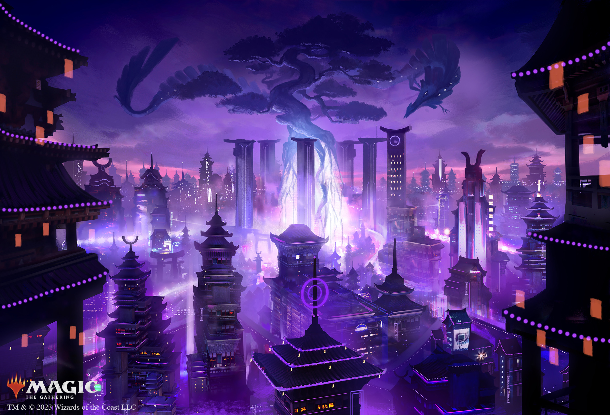
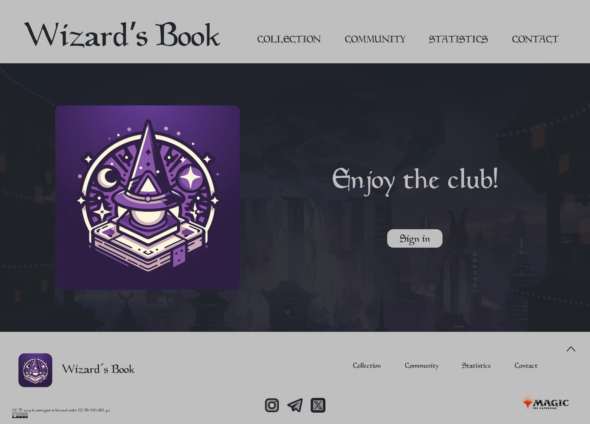

# UT06 - UT7. Proyecto. Creando landing page con elementos multimedia e interactivos

> # UT6

## 1. Realiza el diseño de la página landing haciendo uso de Figma.

### 1.1 Realiza el diseño del header de la página.
>

### 1.2 Realiza el diseño del cuerpo de la página.
>

### 1.3 La página debe contener al menos:

#### 1.3.1 Imagen vectorial en formato .svg
>
>
>
>

#### 1.3.2 Imagen de mapa de bits
>

>
>
>

## 2. Prepara los elementos multimedia necesarios.

### 2.1 Indica el proceso de obtención de los elementos multimedia.
> - **Imágenes SVG:** [Plugin Icons8 Figma](https://iconos8.es/) insercción desde plugin.
> - **Imagen Kamigawa:** [Recurso Web Oficial MTG](https://magic.wizards.com) descarga y edición en [Photopea](https://www.photopea.com/).
> - **Logo App:** [Image Creator from Microsoft Designer](https://www.bing.com/images/create) generación mediante prompt.
> - **Logo Magic the Gathering:** [Recurso Web Oficial MTG](https://magic.wizards.com) descarga.
> - **Licencia CC:** [Web Creatice Commons](https://creativecommons.org/) descarga tras establecer licencia CC a usar.

### 2.2 Indica qué derechos de propiedad tienen los elementos seleccionados, qué implican dichos derechos y también indica las fuentes desde donde se ha obtenido la información.
> - **Imágenes SVG:** Los derechos de propiedad de Icons8 permiten a los usuarios utilizar y modificar el material con licencia de manera perpetua y mundial, aunque no exclusiva ni transferible, con la posibilidad de revocación por parte de Icons8. Los licenciatarios son responsables de incluir una copia del acuerdo de licencia al distribuir el producto final y deben informar a terceros sobre las reglas de acreditación y distribución. [Fuente](https://intercom.help/icons8-7fb7577e8170/en/articles/5534926-universal-multimedia-license-agreement-for-icons8)
> - **Imagen Kamigawa:** Las imágenes de Magic: The Gathering están protegidas por derechos de autor y por otras formas de propiedad intelectual. Los derechos de propiedad sobre estas imágenes son propiedad de Wizards of the Coast LLC, la empresa detrás de Magic: The Gathering. Como tal, no se pueden utilizar, copiar, distribuir o modificar estas imágenes sin el permiso expreso de Wizards of the Coast LLC. [Fuente](https://company.wizards.com/es/legal/terms)
> - **Logo App:** Los derechos de propiedad del Generador de Imágenes de Designer incluyen el cumplimiento de un contrato de uso, el respeto al código de conducta y la aceptación de los términos de servicio de Microsoft. Microsoft no reclama la titularidad del contenido generado, pero el usuario otorga ciertos derechos de licencia sobre dicho contenido. Además, Microsoft no garantiza el funcionamiento del generador y no se hace responsable de los posibles daños derivados de su uso. [Fuente 1](https://www.bing.com/new/termsofuseimagecreator?FORM=GENTOS) [Fuente 2](https://www.microsoft.com/es-es/servicesagreement)
> - **Logo Magic the Gathering:** Las imágenes de Magic: The Gathering están protegidas por derechos de autor y por otras formas de propiedad intelectual. Los derechos de propiedad sobre estas imágenes son propiedad de Wizards of the Coast LLC, la empresa detrás de Magic: The Gathering. Como tal, no se pueden utilizar, copiar, distribuir o modificar estas imágenes sin el permiso expreso de Wizards of the Coast LLC. [Fuente](https://company.wizards.com/es/legal/terms)
> - **Licencia CC:** Las imágenes de Creative Commons se ofrecen bajo licencias Creative Commons, que permiten a los usuarios compartir, copiar y redistribuir el material de diversas maneras, según los términos de la licencia específica asociada con cada imagen. Las licencias Creative Commons varían en términos de uso, como atribución, no comercialidad, compartir igual, entre otros. Es importante revisar la licencia específica asociada con cada imagen para comprender los términos y condiciones exactos de su uso. [Fuente](https://creativecommons.org/terms/)

### 2.3 Exporta dichos elementos multimedia a, al menos, 3 formatos diferentes.
> Los elementos multimedia han sido exportados a SVG, PNG, JPG y WebP.

### 2.4 Justifica la decisión de escoger esos formatos para esos elementos multimedia.
> - **SVG:** Escalables sin perder calidad además de permitir la interactividad y la animación.
> - **PNG:** Para transparencias y calidad visual.
> - **JPG:** Sin transparencias con gran compresión pero poca perdida calidad. Gran compatibilidad.
> - **WebP:** Alta compresión sin perdida de calidad. Carga rápida, optimizados.

## 3. Realiza la implementación de la página diseñada.

### 3.1 Realiza la implementación de la página.
>

### 3.2 Abre la página desde diferentes navegadores y comprueba que en todos se ve igual.
> Comprobado en Google Chrome, Opera GX, Mozilla Firefox y Microsoft Edge.

---

> # UT7

##  1. Realiza el diseño del elemento interactivo que se desee implementar de entre las siguientes opciones:

### 1.1 Tabs
### 1.2 Acordeón
### 1.3 LightBox
### 1.4 Carrousel/Slider

##  2. Realiza la implementación de la página diseñada.

### 2.1 Realiza la implementación del código HTML.

### 2.2 Realiza la implementación del código CSS.

### 2.3 Realiza la implementación del código JS.

##  3. Comprueba el funcionamiento de tu elemento interactivo en diferentes navegadores.

### 3.1 Adjunta pantallazos que muestren el correcto funcionamiento del elemento en diferentes navegadores.

##  4. Incluye elementos multimedia en tu elemento interactivo.

### 4.1 Incluye elementos multimedia en al menos 3 formatos diferentes (relacionado con UT06).

---

>[Enlace Proyecto Figma](https://www.figma.com/file/DV9mFSuOTEvAs4un6MqLui/UT06---UT7.-Proyecto.-Creando-landing-page-con-elementos-multimedia-e-interactivos?type=design&node-id=0%3A1&mode=design&t=rXaTayfx9O9gaNAx-1)

[Inicio README](#top)